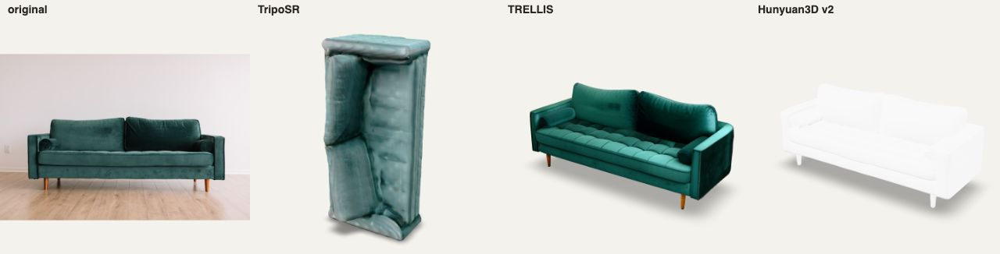
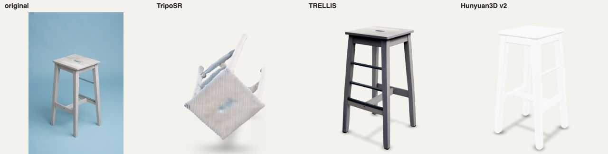
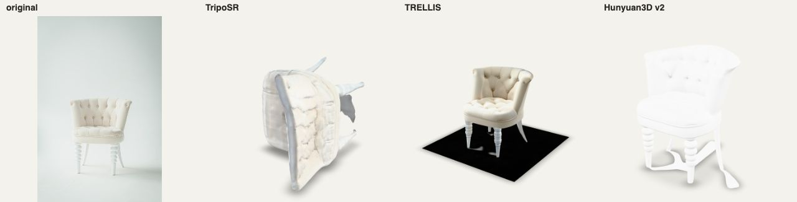
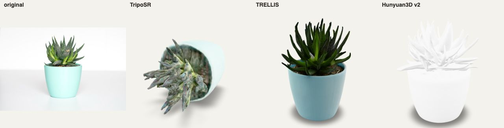
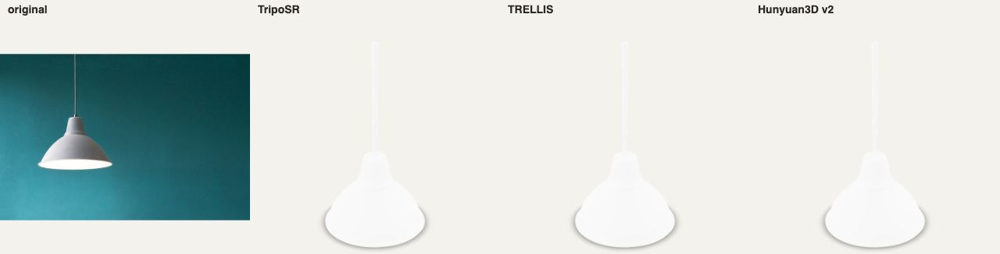
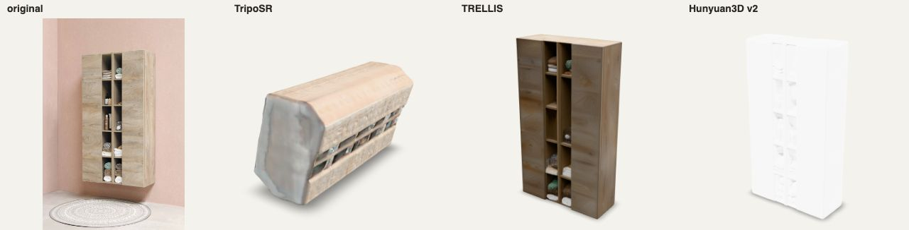

# 图生 3D 模型评测(fal.ai 真机实测)

> 目的:为「现场相机 → 3D」选一条**实时可用**的生成路径。
> 评测集:6 张真实家具照片(Unsplash)——sofa(干净背景)、chair(细腿吧凳·难例)、armchair(白色簇绒)、plant(多肉·细节难例)、lamp(吊灯)、cabinet(带房间上下文·难例)。
> 计时口径:`fal_client.subscribe` 提交到返回(含排队+推理+网络),另计 GLB 下载。本机网络含代理。两轮实测(2026-07-08 / 07-09)结论一致。

## 结论速览

| 模型 | fal 端点 | 热启动 gen | 冷启动 | 效果 | 定位 |
|---|---|---|---|---|---|
| **TRELLIS** | `fal-ai/trellis` | **16–25s** | ~54s | ⭐ 6/6 惊艳:几何+贴图接近原图,难例全过 | ✅ **主力推荐** |
| Hunyuan3D v2(默认) | `fal-ai/hunyuan3d/v2` | **9.5–15s** | — | 几何很好,但**默认无贴图(白模)** | 几何快出场景 |
| Hunyuan3D v2 + 贴图 | 同上 `textured_mesh:true` | 24–33s | — | 贴图效果好(绒面/木腿还原) | 比 TRELLIS 慢,备选 |
| TripoSR | `fal-ai/triposr` | 4.4–9.5s | ~95–121s | ❌ 6/6 差:几何融化、朝向乱、纹理糊 | 只配当占位/秒级预览 |

**最终建议:现场「拍照→3D」走 TRELLIS 热端点,约 20s,用「抠图→扫描→建模」的过程动画吃掉等待;脚本化流程全部预生成缓存。**

**关键工程要求:demo 开场前必须预热端点**(每个模型先发一张垃圾图),否则第一发撞冷启动 54–121s,现场直接翻车。

## 效果对比(原图 / TripoSR / TRELLIS / Hunyuan v2 默认)

| | |
|---|---|
|  |  |
|  |  |
|  |  |

逐条观察:
- **TRELLIS**:六张全部高还原。绿绒沙发纹理几乎复刻;细腿吧凳的四条腿+横档完整;多肉的叶片逐片建模;柜子在有房间背景干扰下仍抠对了主体。唯一瑕疵:armchair 底下多了一块黑色地板(把阴影当几何了)。
- **Hunyuan v2 默认**:几何质量与 TRELLIS 同档,但返回白模——`textured_mesh:true` 才有贴图(sofa 实测 23.7s / chair 33.4s,贴图质量好),加了贴图就失去速度优势。
- **TripoSR**:全部翻车——模型融化、轴向随机(沙发立起来、凳子翻倒)、纹理涂抹。即使当"秒级预览"给用户看也会拉低观感,不建议出现在演示里。

## 时间明细(第二轮 2026-07-09,18/18 成功)

```
triposr  sofa      gen  94.50s  (冷启动)  dl  5.43s   1.9 MB
triposr  chair     gen   6.91s            dl  4.79s   1.5 MB
triposr  armchair  gen   5.98s            dl 10.90s   2.2 MB
triposr  plant     gen   9.55s            dl  9.76s   3.3 MB
triposr  lamp      gen   7.75s            dl 11.15s   0.9 MB
triposr  cabinet   gen   8.20s            dl  3.93s   2.4 MB
trellis  sofa      gen  24.87s            dl  4.61s   1.4 MB
trellis  chair     gen  16.30s            dl  4.44s   1.3 MB
trellis  armchair  gen  18.87s            dl  4.35s   1.2 MB
trellis  plant     gen  24.10s            dl  6.94s   2.4 MB
trellis  lamp      gen  16.46s            dl  5.94s   1.4 MB
trellis  cabinet   gen  21.25s            dl  9.70s   1.3 MB
hunyuan  sofa      gen   9.94s            dl 15.15s   5.5 MB
hunyuan  chair     gen  10.58s            dl 12.73s   5.5 MB
hunyuan  armchair  gen  10.41s            dl 14.86s  10.4 MB
hunyuan  plant     gen  10.28s            dl 16.41s  13.4 MB
hunyuan  lamp      gen   9.55s            dl 46.71s   4.5 MB
hunyuan  cabinet   gen  15.06s            dl  9.06s   6.6 MB
```

第一轮(2026-07-08)数据规律一致:triposr 冷启动 120.98s / 热 4.4–6s,trellis 冷 53.7s / 热 19–27s,hunyuan 热 ~8s。

其他工程观察:
- hunyuan 的 GLB 明显更大(4.5–13.4 MB vs trellis 1.2–2.4 MB),**手机端加载/转发链接更吃亏**,trellis 的文件大小对移动端最友好。
- 下载耗时波动大(3.9–46.7s,走代理),App 端应在生成完成后台预取,别让用户盯着下载条。
- TripoSR 输出的坐标轴不统一(模型躺倒/立起),如要用必须做朝向归一化。

## demo 落地策略

1. **脚本化流程(刷视频→摘抄→3D)**:全部提前用 TRELLIS 生成并缓存,现场零等待。
2. **现场拍照→3D(必须真实时)**:TRELLIS 热端点 ~20s;UI 播「抠图→点云→网格→贴图」过程动画,20s 体感是"在建模"而不是"在等待"。
3. **开场前预热**:对 trellis(和备用模型)各发一次请求;活动网络不可控,预热同时也是连通性检查。
4. **兜底**:若现场网络挂掉,退化为"从缓存库检索最相似模型"(以图搜模型),观感不塌。

## 背景:为什么不是免费 HF Space

系统性探测结论(2026-07-08):TripoSR / SF3D / InstantMesh / LGM / Shap-E / Unique3D / CRM / TripoSG / DreamGaussian 的官方 Space 全部损坏、下线或 gated;唯一活着的 `tencent/Hunyuan3D-2` 免费队列 >600s(带 token 也一样)。免费路径无法支撑现场 demo。

## 背景:为什么不是 iOS 原生

- **RoomPlan**:真实时+免网络,但依赖 LiDAR(仅 Pro 机型),不满足"所有人的手机都能用"——已否决为基础方案,只能作 Pro 机型加分项。
- **Object Capture**:端上摄影测量,分钟级,不满足实时。
- 结论:通用路径 = 普通 RGB 照片 → 云端图生 3D(fal 热端点)。

## 复现

```
cd bench
python3 -m venv venv && ./venv/bin/pip install fal-client httpx
echo '<FAL_KEY>' > .fal_key   # 不入 git
./venv/bin/python fal_bench.py            # 3 模型 × 6 图,结果落 results/fal/
./venv/bin/python hunyuan_tex_test.py     # hunyuan 带贴图补测
# 效果对比页:python3 -m http.server 8123 后开 compare.html?img=sofa(需 shots 接收器 recv.py)
```

GLB 产物在本机 `bench/results/fal/`(gitignore,防仓库膨胀);对比截图在 `bench/shots/`。
